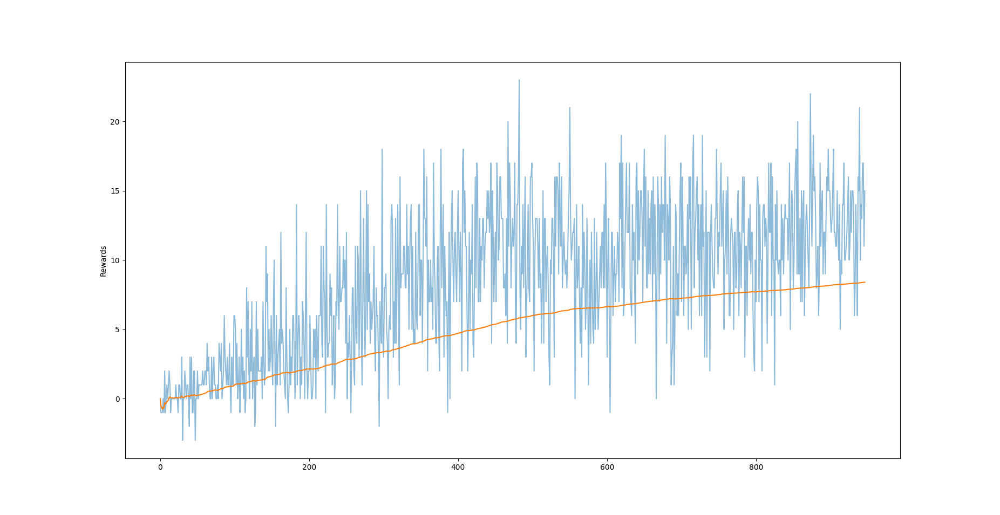

# First Person Searching - Navigation project
This project proposes a solution to a First Person Searching problem. The project is basedon the P1-navigation projected from Udacity - Deep Reinforcement Learning course.

## Installation
- Install Unity python packages (https://github.com/Unity-Technologies/ml-agents/blob/main/docs/Installation.md)
- Numpy
## The environment

The project environment comprises an arena surrounded by grey fences, and a number of blue and yellow bananas are spawn randomly in the area. All bananas stand still after spawning. 

The agent can perform only three actions: MOVE FORWARD, TURN LEFT, and TURN RIGHT, and receives a positive reward when it collects a yellow banana and a negative one when it collects a blue banana. No reward is received while the agent is moving without collecting any bananas.

The episode ends either when 13 yellow bananas are collected or the timeout is reached. 

## The method
The presented solution employs the Deep Q-Network (DQN) method. 

This method expands one the most common RL techniques based on the composition of the state-action table called Q-Table. The table is filled using data collected from the interaction between the agent and the environment within a limited span of time, i.e. episode. Although the interaction is split into episodes, the learning happens at every iteration within the episode without waiting for the episode to finish. This improves the velocity of the learning cycle and does not compromise the learning of the true behaviour that the agent is observing.

One of the greatest shortcomings of the Q-Table formulation is the number of states increases quickly with the complexity of the problem, and tables with hundreds of states/action pairs are common. To avoid the problem, a few researchers have proposed to approximate the Q-table and substitute it with a neural network. The network will have a state as input, and it will provide a value for all the possible actions of the agent. In this framework, we shift the problem from dealing with the large amount of data held in the canonical Q-Table to the seeking of reliable and quick methods to select the best parameters of the network. 

As presented in the paper that initially proposed the DQN method, a naive application of the DQN encounters two problems. First, the continuous update of the network using the most recent data contained in the network creates instability in the learning process. The network iterates on many spurious data and does not well identify the core behaviour to learn. Second, not all episodes have the same importance and discarding the entire episodes may lead to a slow and inaccurate learning. As for the former issue, we use two networks: a Target network and a Local network. The Target network holds a 4 steps older version of the current network, and it represents a stable target for the local network, which is instead updated at every step. This reduces the noise and improves the overall learning process. As for the latter, we create a buffer of already observed state/action/reward/next_state tuple. Because of its composition, it is usually called Replay Buffer. Thanks to the replay buffer, we can re-experience past observations and learn from these data. Moreover, the replay buffer contributes to detach the state/action to the temporal sequence that the network experiences observing the episode in sequence.

## RL Hyperparameters
_Max number of episodes_: 2000

_Max time per episode_: 500

_Gamma_: 0.99

_Starting eps_: 1.0

_Minimum eps_: 0.05

_Decay eps_: 0.98

_Replay Buffer_: 10000

_Batch size_ : 64

_Update target frequency_: 10

## NN Hyperparameters

Network structure: Three linear layer with ReLu activation on each of them

_First Hidden Layer_ = 64 nodes

_Second Hidden Layer_ = 64 nodes

## The result
We consider the algorithm solved when the averaged reward is equal or above 13.0.

The algorithm reaches an average a reward above 13.0 in 100 episodes after 928 episodes.

## Future work

Future extensions to the algorithm can be:
- Double DQN 
- Policy-based learning _e.g._ REINFORCE
